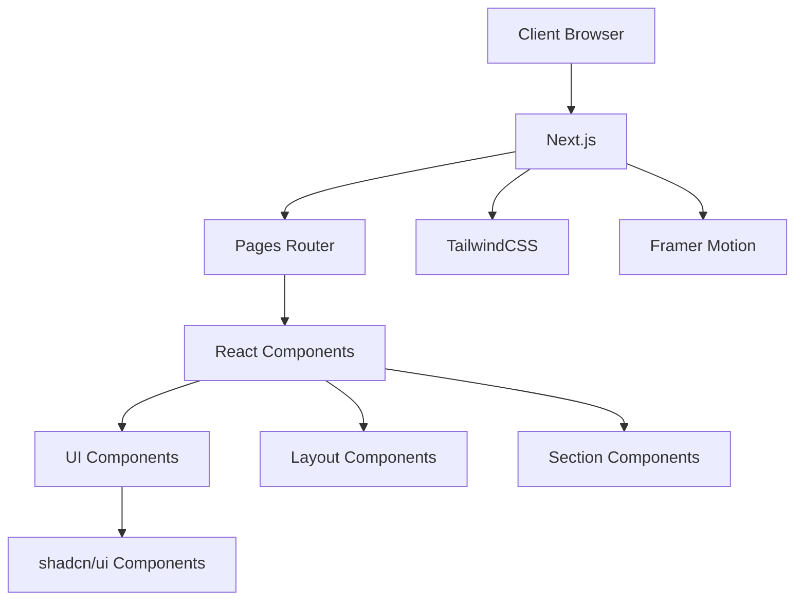

# System Patterns

## System Architecture
This portfolio is built using a modern React-based architecture with Next.js as the framework:



## Key Technical Decisions
1. **Next.js**: Chosen for its optimized rendering, routing capabilities, and enhanced SEO performance.
2. **TailwindCSS**: Selected for rapid UI development with consistent design tokens and responsive utilities.
3. **shadcn/ui**: Utilized for accessible, customizable UI components built on Radix UI primitives.
4. **Framer Motion**: Implemented for smooth, declarative animations that enhance user experience.
5. **TypeScript**: Employed for type safety and improved developer experience.
6. **Mobile-first Approach**: Ensures optimal experience across all device sizes.

## Design Patterns

### Component Structure
- **Atomic Design Methodology**: Organizing components from atoms to templates
  - Atoms: Buttons, inputs, icons
  - Molecules: Cards, form groups
  - Organisms: Sections, complex interactive elements
  - Templates: Page layouts

### State Management
- **Local Component State**: Using React's useState for component-specific state
- **Props Drilling**: For passing data between closely related components
- **Context API**: For global theme/UI state if needed

### Styling Approach
- **Utility-First CSS**: Using Tailwind's utility classes
- **Component Composition**: Building complex UIs from smaller, reusable parts
- **Responsive Design**: Mobile-first approach with responsive breakpoints

### Animation Patterns
- **Entrance Animations**: Revealing content as it enters the viewport
- **Micro-interactions**: Subtle animations for interactive elements
- **Scroll-based Effects**: Animations triggered by scroll position
- **Smooth Transitions**: Between pages and UI states

## Component Relationships

### Layout Structure
```
Layout
├── Header/Navigation
├── Main Content
│   ├── Hero Section
│   ├── About Section
│   ├── Projects Section
│   │   └── Project Cards
│   ├── Skills Section
│   │   └── Skills Visualization
│   └── Contact Section
└── Footer
```

### Data Flow
- **Static Content**: Pre-rendered at build time
- **Interactive Elements**: Client-side state management
- **Projects Data**: Structured content that can be updated independently
- **Configuration-based Styling**: Theme values defined in central configuration 